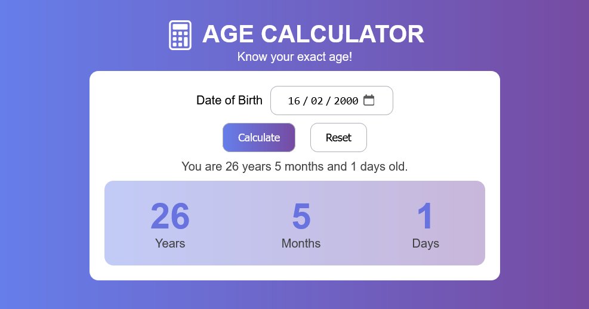

# 🎂 Age Calculator

A responsive Age Calculator built with that calculates a person's exact age in years, months, and days based on their date of birth.



## ✨ Features

- Calculate exact age in years, months, and days
- Birthday detection with a special greeting 🎉
- Input validation
- Error handling for invalid dates
- Reset functionality
- Responsive layout
- Clean and modern UI


## 📚 Concepts Practiced

- DOM Manipulation
- Event Listeners
- JavaScript Functions
- Date Object
- Conditional Logic
- Form Validation
- CSS Flexbox
- Responsive Design
- CSS Class Manipulation


## 🚀 Live Demo
https://rainbow-frangollo-8b2504.netlify.app/


## 📂 Installation

Clone the repository

```bash
git clone https://github.com/aishwaryagaikwad21/age-calculator.git
```

Open

```
index.html
```

in your browser.

## 📖 What I Learned

While building this project I learned:

- Breaking a real-world problem into smaller functions
- Designing an algorithm
- Handling date calculations and edge cases
- Separating business logic from UI logic
- Using CSS classes instead of inline styles
- Debugging DOM and CSS issues

## 🔮 Future Improvements

- Validate impossible dates (e.g. 31 February)
- Add animations
- Improve accessibility
- Dark Mode

## 📄 License

Licensed under the MIT License © 2026 Aishwarya Gaikwad.